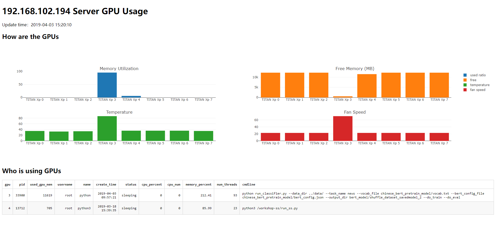

# Bifrost: A Simple GPU Monitor

[简体中文](./README_zh.md)

A simple [dash](https://github.com/plotly/dash/)-based GPU monitor that uses web pages to continuously view GPU usage.



## Features

- Use the webpage to continuously view basic GPU usage, including GPU usage, remaining graphics memory, temperature, and fan speed
- Check who is using the GPU, including user, process ID, process creation time, process creation commands, etc. For details, see the description below.

## Dependencies

Bifrost relies mainly on the following:

- Python 3.6+
- dash
- psutil
- pandas
- numpy
- nvidia-ml-py3

You can install these dependencies with the following command:

```bash
pip install dash psutil pandas numpy nvidia-ml-py3
```

You can also use `requirements.txt` to install them:

```bash
pip install -r requirements.txt
```

## Usage

```bash
python app.py
```

Then open http://locahost:8150 or http://{*your_ip*}:8150 in your browser. Bazinga!

## Field description

- `gpu`: GPU ID
- `pid`: The process ID
- `used_gpu_mem`: The GPU memory used by the process
- `username`: The owner of the process
- `name`: The Process name
- `create_time`: The process creation time
- `status`: The process status
- `cpu_percent`: CPU utilization of the process
- `cpu_num`: Which CPU this process is currently running on
- `memory_percent`: Memory utilization of the process
- `num_threads`: The number of threads currently used by this process
- `cmdline`: The command line this process has been called

## LICENSE

MIT.
