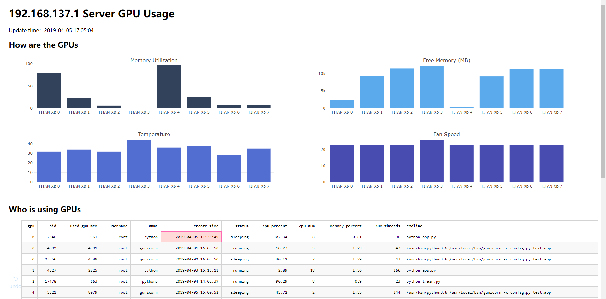

# Bifrost：一个简单的 GPU 监视器

一个简单的基于 [dash](https://github.com/plotly/dash/) 的 GPU 监视器，使用网页持续查看 GPU 使用情况。



## 特性

- 使用网页持续查看 GPU 的基本使用情况，包括 GPU 使用率、剩余显存、温度和风扇转速
- 查看是谁在使用 GPU，包括使用者、进程 ID、进程创建时间和进程创建命令等 12 项信息，详细的说明见下方字段说明

## 依赖

主要依赖如下：

- Python 3.6+
- dash
- psutil
- pandas
- numpy
- nvidia-ml-py3

你可以通过下面的命令来安装这些依赖：

```bash
pip install dash psutil pandas numpy nvidia-ml-py3
```

也可以使用 `requirements.txt` 来安装：

```bash
pip install -r requirements.txt
```

## 使用

```bash
python app.py
```

也可以使用 gunicorn 启动：

```bash
gunicorn -c config.py app:server
```

然后在浏览器中打开 http://locahost:8150 或者 http://{*your_ip*}:8150。Bazinga！

## 字段说明

- `gpu`：GPU 编号
- `pid`：进程 ID
- `used_gpu_mem`：该进程已使用的显存
- `username`：该进程的拥有者
- `name`：进程名
- `create_time`：进程创建时间
- `status`：进程状态
- `cpu_percent`：该进程的 CPU 利用率
- `cpu_num`：运行该进程的 CPU 的编号，即该进程运行在哪个 CPU 上
- `memory_percent`：该进程的内存利用率
- `num_threads`：该进程当前使用的线程数
- `cmdline`：创建该进程的命令

## LICENSE

MIT.
